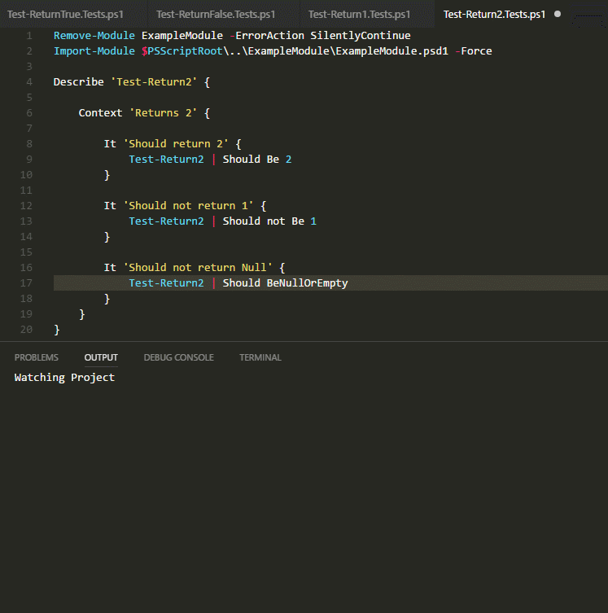
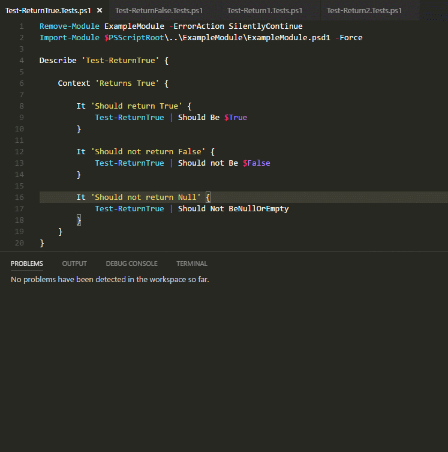

# VSCode Watcher Tasks for Pester

These tasks uses VSCode [Watcher Tasks](https://code.visualstudio.com/docs/editor/tasks#_background-watching-tasks) to watch for file system changes to auto trigger Pester tests.

## Tasks

- Watch.Project: Runs all tests if any ps1 in the project is modified.
- Watch.Project.Single: Runs the Test for any modified file in module directory or Test in Tests directory.
- Watch.Tests: Runs all tests if any Test in the project is modified.
- Watch.Tests.Single: Runs the Test for any modified Test.

## Watcher Runs all Tests

## Watcher Runs only Tests for edited file

## Issues

Currently, the Tasks that run single tests will overwrite any unresolved issues previously found. I have filed a [feature request](https://github.com/Microsoft/vscode/issues/22242) to improve this behavior.